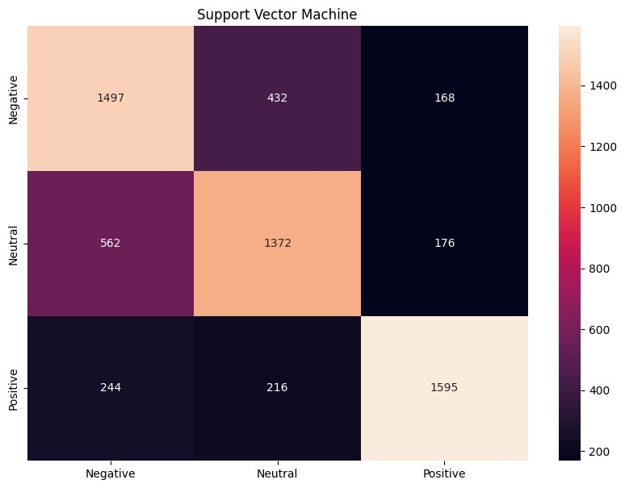

Personalized Hotel Recommender using Sentiment Analysis
# Project - Final Report
<iframe
  src="https://www.youtube.com/embed/0p735_bOaM0/"
  style="width:100%; height:500px;"
></iframe>
# Dashboard
Note: Please allow this webpage to access your location to show the nearest hotels.

# Introduction

 One of the most basic human activity is travel. Finding quality lodging when traveling is the hardest part. According to data from travel reservations in 2018, there were around 148 million online bookings, of which 82% were made using an app or website [1]. This highlights how dependent individuals are on internet and applications to find lodging. Most of these websites and applications offer some sort of measure to assist customers in making hotel reservations, but frequently they don't focus on the user and don't take into consideration their unique needs. Many studies on this subject of hotel recommendation systems focus just on user preferences and ignore hotel reviews or fail to account for the important differences between various users [2]. The main goal of this project to provide user with personalized  hotel recommendation.
 
 
The dataset that we are using consists reviews of various hotels present in Europe. It contains features such as Hotel Address, Review Date, Average Score (Average of ratings for a single hotel), Hotel Name, Reviewer Nationality, Total Number of Reviews, Positive Review, Negative Review, Reviewer Score (raiting given to hotel by the customer), days since review.

# Problem Definition and Motivation

 When reserving a hotel, the most popular approach for making a good decision has been to read the ratings and reviews. But the main issue here is that these evaluations were made based on the viewpoint of one individual. A 5-star rating for one person may be a 2-star rating for another. Some people would select a hotel with a lower price over the ambiance, while others might do so regardless of cost. 
 
 
Instead of displaying a generic hotel rating, our goal is to help the customer by making more individualized hotel suggestions that consider their preferences for different factors like pricing, cuisine, atmosphere, etc. In turn, this facilitates a quicker and more effective process for the customer to choose the best hotel depending on their preferences.

## Dataset Collection and Cleaning

 The project makes use of the “515k-hotel-reviews-data-in-europe” dataset for training the models. The data was scraped from Booking.com. The data comprises of reviews evaluated by 515,000 people for 1493 upmarket hotels in Europe. There are 17 feature columns in total, including Hotel Address, Review Date, Average Score, Hotel Name, etc., in the csv file. The unused columns in the dataset were removed because they don't have significant contribution to the model.
 
 
Additionally, some of the data samples were just given with the overall ratings rather than a descriptive comments. Since the project concentrates on the user preferences rather than quantitative review value, such data is replaced with an empty string.
 
 
Screenshots of both the original and modified data sets are provided below.

### Original Dataset from Kaggle:

<a href="https://drive.google.com/file/d/1Rn9bwG32V87wDp4VuS63RZMwhIngSae3/view?usp=share_link">Download Original Dataset</a>

### Processed Dataset:

<a href="https://drive.google.com/file/d/1AzyuTb1BVKKusaFd5LGhALzzqpmF7Unk/view?usp=share_link">Download Cleaned Dataset</a>

## Data Preporcessing:

The Preprocessing step includes tokenization, tagging parts of speech, removing stop words, stemming, noun extraction and noun filtering. Tokenization mainly focuess on detecting words. Then the words get tags that determine their syntactic role (such as verb, adjective, etc.) in the sentence. The stop words like "a", "an", "the", "that", "of", "from" are deleted. Then the suffix and prefix of the words are deleted and the stem of the word is retained.
 
 
The stemming process helps to reduce all derivatives of a word, which are not semantically different, into a common concept. For example, if a document contains words like ‘‘eating’’ and ‘‘eaten’’, they are all considered as ‘‘eat’’. As we are looking for preferences of the user that are usually in the form of nouns, the words that have received the noun tag are extracted. Since the number of these nouns may be very large, unrelated nouns are filtered.

# Data Analysis:
## Analysing the number of reviews based on the reason for reviewer visit
  

The bar chart shows that most people visit hotels for leisure trips as couples or by themselves. Fewer people came with their family or group, and even fewer came with friends. Out of 515k reviews, there are 100k reviews tagged as business, which means 19% of the reviewers came for business trips. However, we should consider that people who came for leisure trips are usually more likely to have time or are more willing to write reviews, while those who came for business trips may be too busy or simply do not want to write any reviews. 
 

## Aspects that attracts the customers

For Positive Reviews, most people are probably satisfied with the location, very convenient and easy-to-find restaurants, friendly and helpful staff, clean room, and comfortable bed.

## Aspects that need improvements

The negative reviews also mentioned “breakfast”, “room” and “staff” quite often, but maybe people were complaining about the staff who were being rude, the small rooms, and the coffee provided during the breakfast. The air conditioning or the shower system may need improvements as we see words like “hot”, “cold”, “air”, “bathroom” and “shower” in the word cloud. The hotel may also need to solve issues related to soundproofing and parking.

  
# Results and Discussions:

## Supervised Learning
<!--
<ul>
  <li>Modeled a Sentiment classifier to tag the reviews as positive, negative, or neutral categories with an accuracy of 60 – 70 %.</li>
  <li>Analyzed it with different classification algorithms.</li>
</ul>
-->
### Approach:

 For the purpose of categorizing our data into classes of positive, negative, and neutral information, we use the supervised learning methods like Multi-class Logistic Regression, Multinomial Naive Bayes, and Support Vector Machine. For training and testing, the data was split in an 60:20:20 ratio.
 

 
 The cleaned and analyzed raw datset has uncategorized reviews. To categorize them, we use a library called <strong>Vader Sentiment Analyzer</strong> which will calculate the sentiment score for each review in the dataset. The range of Sentiment Score varies between -1 and +1. In order to classiy them into the buckets of negative, neutral and positive, a threshold is fixed. The classification of the reviews based on the sentiment score is as follows:

  <ul>
    <li> Define the class as Negative, if the sentiment score is between -1 and -0.25 </li>
  
   <li> Define the class as Neutral, if the sentiment score is between -0.25 and +0.25 </li>
  
   <li> Define the class as Positive, if the sentiment score is between +0.25 and +1. </li>
 </ul>

 This classificaion of data from the Vader Semtiment Analyzer is assumed to be the ground truth labels of the data. With data split of 60:20:20 as train, validation, and test samples. Supervised learning algorithms are applied to classify the data. Further, the model's performance is evaluated by various metrics such as F1 score, Accuracy, Precision, Recall, and ROC-AUC. 

  
### Implementation:

Multinomial Naive Bayes, Logistic Regression and Support Vector Machine were utilized to classify the reviews into the positive, negative and neutral. 
 
The confustion matrix for all the models are as follows:

## Naive bayes (Confusion Matrix):

## Logistic regression (Confusion Matrix):

## Support Vector machine (Confusion Matrix):
  

  
## Evaluation Metrics:
  
Based on the confusion matrix above, Precision, Recall and F1 Score for all the three models are computed and and tabulated below:

| Naive Bayes |  Precision | Recall | F1 Score
| ------------- | ------------- | ------------- | ------------- |
| Negative     | 0.62  | 0.66 | 0.64  |
| Neutral      | 0.65  | 0.54 | 0.59  |
| Positive     | 0.70  | 0.78 | 0.74  |

 

| Logistic Regression |  Precision | Recall | F1 Score 
| ------------- | ------------- | ------------- | ------------- |
| Negative     | 0.70  | 0.67 | 0.68  |
| Neutral      | 0.69  | 0.68 | 0.69  |
| Positive    | 0.81  | 0.84 | 0.82  |

 

| Support Vector Machine |  Precison | Recall | F1 Score 
| ------------- | ------------- | ------------- | ------------- |
| Negative     | 0.65  | 0.71 | 0.68  |
| Neutral    | 0.68  | 0.65 | 0.66  |
| Positive   | 0.82  | 0.78 | 0.80 |

 
Based on the Precision, Recall and F1 Score calculated above, The metrics like Macro-average Precision, Weighted Average Precision, Macro Average Recall, Weighted Average Recall, Macro Average F-1 Score, Weighted Average F-1 Score and accuracy are computed and tabulated below.
  
  | Evaluation Metrics  | Macro Average Precision | Weighted Average Precision  | Macro Average Recall | Weighted Average Recall | Macro Average F-1 Score | Weighted Average F-1 Score | Accuracy |
| ------------- | ------------- | ------------- | ------------- | ------------- |------------- |------------- |------------- |
| Naive Bayes    |  0.66 | 0.65 | 0.66 | 0.66 | 0.65 | 0.65 | 0.65 |
| Logistic Regression    | 0.73 | 0.73 | 0.73 | 0.73 | 0.73 | 0.73  | 0.73 |
| Support Vector Machine | 0.72  | 0.72 | 0.71 | 0.71 | 0.71 | 0.71   | 0.71 |

  From the above metrics, it is observed that Logistic Regression performs the best in classifying the reviews into positive, negative and neutral followed by the Support Vector Machine and Naive Bayes. 
  
  Further, to complement the justification, Receiver Operating Characteristic (ROC) Curves for all the models were plotted. 

## ROC Graphs for our implementations:
  
  
## Naive bayes (ROC Curve):
  
  
## Logistic Regression (ROC Curve):
  
  
  
## Support Vector Machine (ROC Curve):
  
  
  From the ROC curves, it is justified that the logistic Regression performs better than the Support Vector Machine and Naive Bayes.
  
## Unsupervised Learning :
    
### Approach:

The purpose of unsupervised learning is to cluster the nouns with similar semantics into clusters and thereby these clusters are named manullay based on the words in the clusters. To achieve this task, First, we extracted the noun in the sentence using an open-Source tool called pyABSA, and its confidence factor with the help of the supervised learning algorithm implemented above. Secondly, the words extracted are translated into word embeddings with the help of BERT to get the contexual information. These word embeddings are used for clustering the words. Once the clusters are generated, we manually named each cluster with an appropriate aspect. Finally, clusters are mapped to each hotel based on the word set and confidence level. 

### Implementation:

Clustering of words is implemented using KMeans, Gaussian Mixture Models(GMM), and Hierarchical Clustering. Considering the advantage that the Hierarchical clustering does not need to have the number of clusters defined at beginning, we chose to implement it by following the below steps

## Hierarchical Clustering:
### Steps:
  <ol>
  <li>Firstly, we create a noun vector from each review. Ex: [ ‘Food’, ‘Noodles’, ‘room’] </li>
  <li>After the noun vector is formed, we use the Spacy library to determine how similar each word is with other word in the vector. A matrix of size (words x words) with similarity values is generated.</li>
    
  <li>The Coorelation matrix for a single example is as shown below:</li>
       
  
  
  <li>The dendogram obtained from Hierarchial clustering is dissected into clusters.</li>
  
   <li>The threshold value to split the dendogram obtained in the previous step is decided based on the number of clusters required.</li>
  </ol>
  
## K-means & GMM:

The clusters obtained from the Hierarchical clustering were pretty accurate. However, when it is implemented using the entire dataset, the model resulted in a large number of clusters which could not be limited by modifying the threshold value and, hence, is not suitable for this usecase. Therefore, We have implemented K-means clustering algorithm, with 8 as the number of clusters and was able to get desired cluster of words at the expense of accuracy. We implemented the same using GMM (Gaussian Mixture Model) with 8 components, and the results show a higher accuracy compared to that of K-means. These clustering algorithm were evaluated using metrics such as Silhouette Coeffifcient, Calinski-Harabasz Index, Davies-Bouldin Index to identify the one with better performance.

# Evaluation Metric
## Unsupervised Learning 
 
| Model |  Silhouette coefficient | Davies-Bouldin Index | Calinski - Harabasz Index 
| ------------- | ------------- | ------------- | ------------- |
| K-means     | 0.43  | 0.705 | 850.62  |
| GMM      | 0.45  | 0.68 | 1050  |

# Team Contribution
<ul>
  <li><strong>Sunil Ravilla</strong> - Supervised Learning, Dashboard</li>
  <li><strong>Prasanth Bathala</strong> - Supervised Learning, Evaluation Metrics</li>
  <li><strong>Nigam Katta</strong> - Unsupervised Learning, Evaluation Metrics</li>
  <li><strong>Hemanth Sai Surya Kumar Tammana</strong> - Unsupervised Learning, Exploratory Data Analysis</li>
  <li><strong>Sahaj Jha</strong> - Unsupervised Learning, Data Collection and Cleaning</li>
</ul>

# References
[1] https://www.stratosjets.com/blog/online-travel-statistics/

[2] K. Takuma, J. Yamamoto, S. Kamei and S. Fujita, "A Hotel Recommendation System Based on Reviews: What Do You Attach Importance To?," 2016 Fourth International Symposium on Computing and Networking (CANDAR), 2016, pp. 710-712, doi: 10.1109/CANDAR.2016.0129.

[3] Abro, Sindhu, et al. "Aspect Based Sentimental Analysis of Hotel Reviews: A Comparative Study." Sukkur IBA Journal of Computing and Mathematical Sciences 4.1 (2020): 11-20.

[4] Schouten, Kim, and Flavius Frasincar. "Survey on aspect-level sentiment analysis." IEEE Transactions on Knowledge and Data Engineering 28.3 (2015): 813-830.
Abro, Sindhu, et al. "Aspect Based Sentimental Analysis of Hotel Reviews: A Comparative Study." Sukkur IBA Journal of Computing and Mathematical Sciences 4.1 (2020): 11-20.

[5] Musto, Cataldo, et al. "A multi-criteria recommender system exploiting aspect-based sentiment analysis of users' reviews." Proceedings of the eleventh ACM conference on recommender systems. 2017.

[6] Pathuri, Siva Kumar, N. Anbazhagan, and G. Balaji Prakash. "Feature Based Sentimental Analysis for Prediction of Mobile Reviews Using Hybrid Bag-Boost algorithm." 2020 7th International Conference on Smart Structures and Systems (ICSSS). IEEE, 2020.
